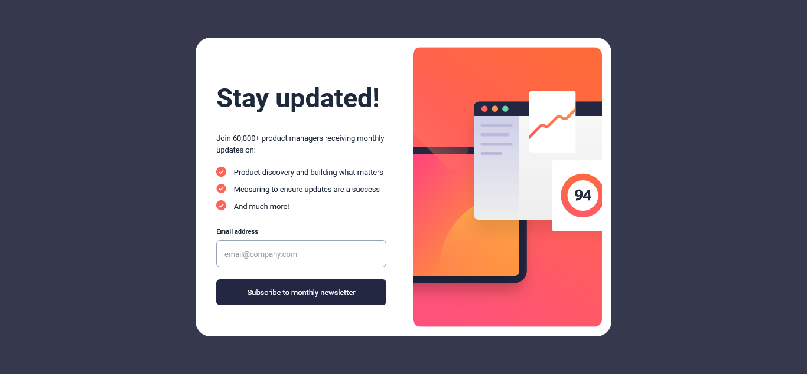

# Frontend Mentor - Newsletter sign-up form with success message solution

This is a solution to the [Newsletter sign-up form with success message challenge on Frontend Mentor](https://www.frontendmentor.io/challenges/newsletter-signup-form-with-success-message-3FC1AZbNrv). Frontend Mentor challenges help you improve your coding skills by building realistic projects. 

## Table of contents

- [Overview](#overview)
  - [The challenge](#the-challenge)
  - [Screenshot](#screenshot)
  - [Links](#links)
  - [Built with](#built-with)
  - [What I learned](#what-i-learned)
  - [Continued development](#continued-development)
  - [Useful resources](#useful-resources)
- [Author](#author)
- [Acknowledgments](#acknowledgments)

## Overview

The Newsletter Sign-up Component is a React-based web application that provides a simple and user-friendly interface for users to subscribe to a newsletter and if successful, The user will be sent to Success webpage. It aims to keep users informed and engaged with regular updates on various topics related to product management.

### The challenge

Users should be able to:

- Add their email and submit the form
- See a success message with their email after successfully submitting the form
- See form validation messages if:
  - The field is left empty
  - The email address is not formatted correctly
- View the optimal layout for the interface depending on their device's screen size
- See hover and focus states for all interactive elements on the page

### Screenshot

### Links

- Solution URL: [Github](https://github.com/dirudeen/Newsletter-signup-component)
- Live Site URL: [Vercel](https://newsletter-signup-component-rho.vercel.app/)

### Built with

- Semantic HTML5 markup
- CSS custom properties
- Flexbox
- CSS Grid
- Mobile-first workflow
- [React](https://reactjs.org/) - JS library
- [Tailwind CSS](https://tailwindcss.com/) - For styles

### What I learned

In this project I was able to learn how react works behind the scenes and how to manage App wide states, such as using the Context Api 

### Continued development

I will continue buliding projects with ReactJs in the future So I can become more proficient with it.

### Useful resources

- [TailwindCSS Docs](https://tailwindcss.com/docs) - This helped me know the correct untility classes I should be using for styling my HTML elements. I really liked how Tailwindcss makes styling more easier and from now on I will definitely be using it on future projects .

## Author

- Frontend Mentor - [@dirudeen](https://www.frontendmentor.io/profile/dirudeen)
- Twitter - [@deenboi22](https://www.twitter.com/deenboi22)

## Acknowledgments

I would like to express my sincere appreciation to Fronted-Mentor for providing me with the invaluable opportunity to utilize their projects for practice and skill development as a frontend engineer. I am particularly grateful for the opportunity to receive feedback and learn from experienced mentors and fellow developers within the Fronted-Mentor community. The constructive criticism and encouragement have motivated me to constantly improve my work and strive for excellence. I am truly thankful for the exceptional learning and growth opportunities provided by Fronted-Mentor. It has been an invaluable resource for my professional development, and I am sincerely grateful for their commitment to nurturing the next generation of frontend developers.
